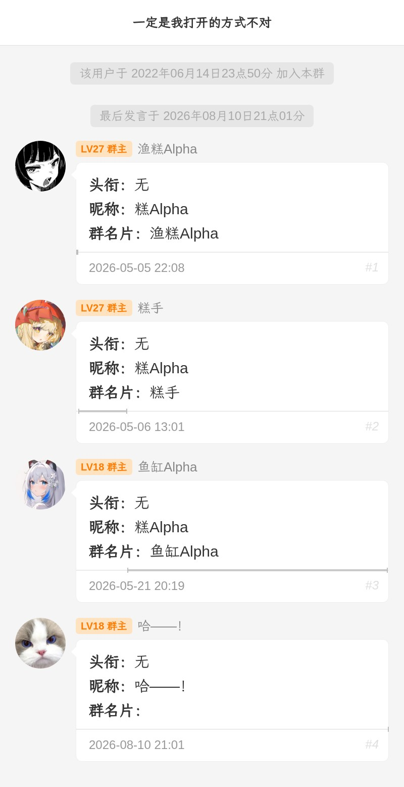
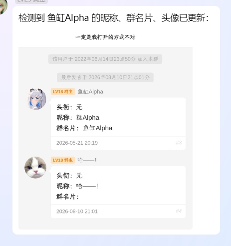
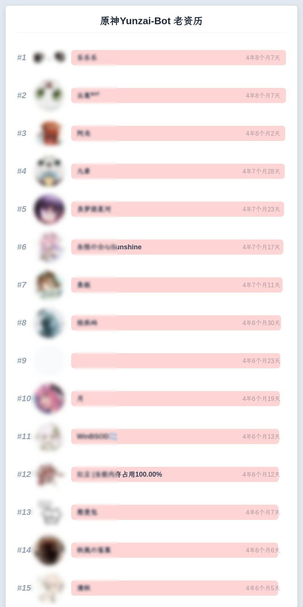
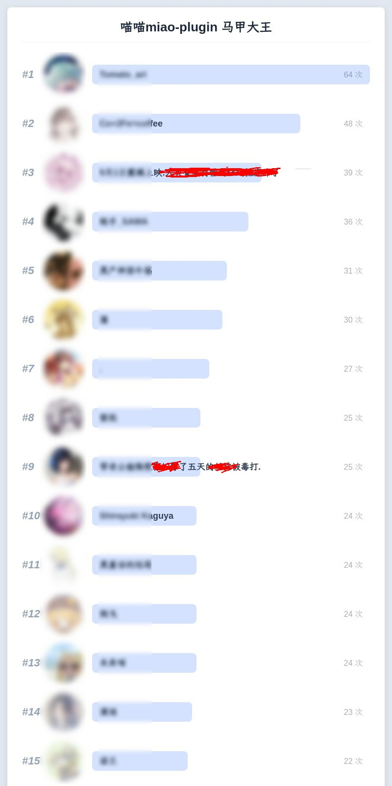
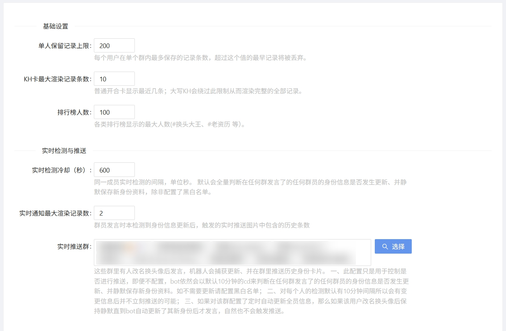

<!--
 * @Author: 渔火Arcadia  https://github.com/yhArcadia
 * @Date: 2026-08-06 19:58:55
 * @LastEditors: 渔火Arcadia
 * @LastEditTime: 2026-08-12 17:19:31
 * @FilePath: /kh-plugin/README.md
 * @Description: 
 * 
 * Copyright (c) 2026 by 渔火Arcadia 1761869682@qq.com, All Rights Reserved. 
-->
# Kh-Plugin

基于Yunzai的群成员昵称、群名片、头衔、权限与头像历史记录存档插件。有效克制群友“改头换面”秽土转生。


</br>


## 核心功能
**查询群友历史身份**



</br>

**支持主动推送**




## 扩展功能

**趣味排行**、获取历史头像文件等。详见[指令列表](./README.md#指令列表)。




## 安装与升级
使用锅巴安装
或者
在Yunzai根目录下执行：
```
git clone https://github.com/yhArcadia/kh-plugin ./plugins/kh-plugin
```
或
```
git clone https://gitee.com/yhArcadia/kh-plugin ./plugins/kh-plugin
```


## Gunba-Plugin

推荐使用[锅巴插件](https://github.com/guoba-yunzai/guoba-plugin)进行个性化配置。




## 指令列表

- `开合 @某人` / `kh @某人` / `KH @某人` / `你是谁 @某人` / `他是谁 @某人`
- `更新群员信息` / `静默更新信息`
- `#删除记录1,2 @某人`、`#添加备注 文本 @某人`、`#设置备注 文本 @某人`、`#删除备注1 @某人`
- `#历史头像 @某人`
- `#换头大王`、`#马甲大王`、`#专一大王`、`#潜水大王`、`#活跃大王`、`#冒泡大王`、`#老资历`、`#小资历`
- `#最老QQ`、`#最短QQ`、`#最小QQ`、`#最新QQ`、`#最长QQ`、`#最年轻QQ`
- `#查信息 [QQ/@某人]`、`#头像时间` / `#头像时长`
- `#who版本`


## QA

- Q：插件名kh代表什么意思？  A：kh是 看history 的缩写，即看看历史身份。并没有其他含义。
- Q：为什么我的排行榜人数很少？  A：初次使用排行类命令，建议先在对应群里执行 更新群员信息 来拉取全员信息，否则排行榜只会包含以发言的群员。

## 相关链接

- [Yunzai插件库](https://github.com/yhArcadia/Yunzai-Bot-plugins-index)
- [锅巴插件](https://github.com/guoba-yunzai/guoba-plugin)


## 交流群

134086404


## 许可证

- 本项目使用GNU Affero General Public License v3.0 or later (`AGPL-3.0-or-later`)开源协议，详见[LICENSE](./LICENSE)。